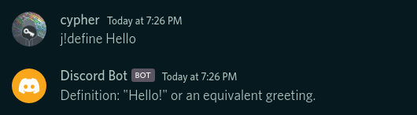
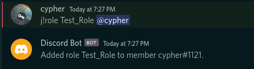

# Discord Bot

Source code for the Intermediate/Advanced batch Discord bot project.

## Showcase (Command and Screenshots)

### Ping

Pings the bot.

### Define

Defines the given English word.

### Role

Creates and adds a role with the given name to the given user.

